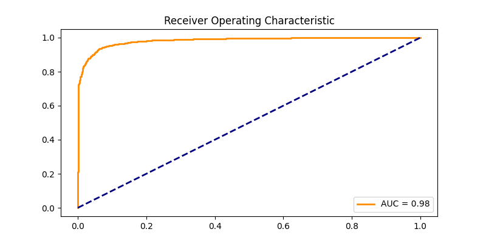
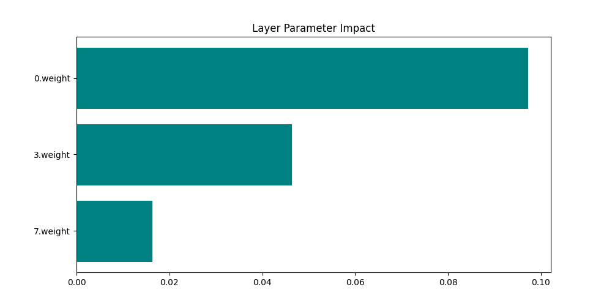

# Medical Image Classification: Master Report
**Generated:** 2026-03-25 11:38

## 1. Test Inferences
Predictions for the unlabelled test data have been generated and mapped to their respective filenames.
- **Output File:** `submissions/final_submission.csv`

## 2. Model Evaluation (Cross-Validation)
### Area Under Curve (AUC)

*(Detailed rates saved in `data/tables/auc_table.csv`)*

### Training Loss

**Loss Data:**
|   Epoch |     Loss |
|--------:|---------:|
|       1 | 0.316313 |
|       2 | 0.175815 |
|       3 | 0.164164 |
|       4 | 0.131746 |

## 3. Parameter Impact (Feature Importance)
For Convolutional Neural Networks, standard tabular features do not exist. Instead, we measure the **Mean Absolute Weight** of the network layers to determine which computational stages are making the heaviest impact on the final decision.

**Impact Data:**
| Layer    |   Mean Abs Weight |
|:---------|------------------:|
| 0.weight |         0.0972503 |
| 3.weight |         0.0463317 |
| 7.weight |         0.0162956 |
