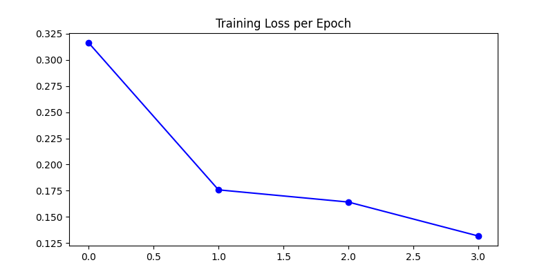
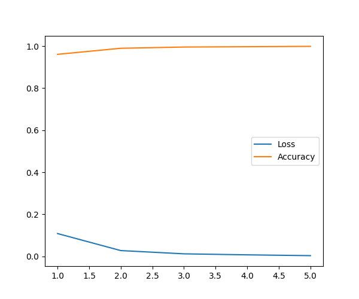
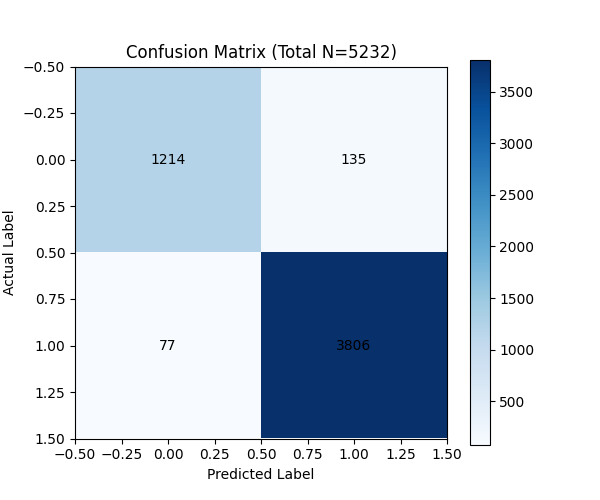
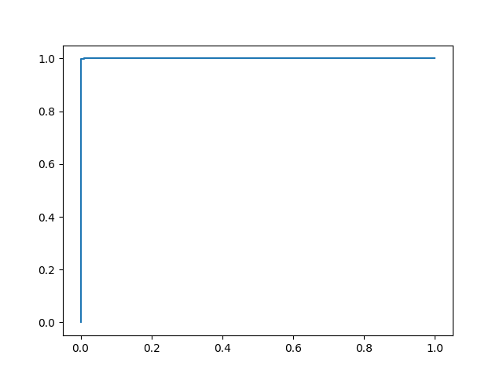

# Medical Image Classification Report

## Performance Summary
| Metric | Result |
| :--- | :--- |
| Accuracy | **99.68%** |
| AUC | **1.00** |
| Test Images Processed | **624** |

## Visualizations
### Training Progress

### Model Performance Analysis

## Data Tables
### Final Results Sample
|   id |   label |
|-----:|--------:|
|    0 |       1 |
|    1 |       1 |
|    2 |       1 |
|    3 |       0 |
|    4 |       0 |